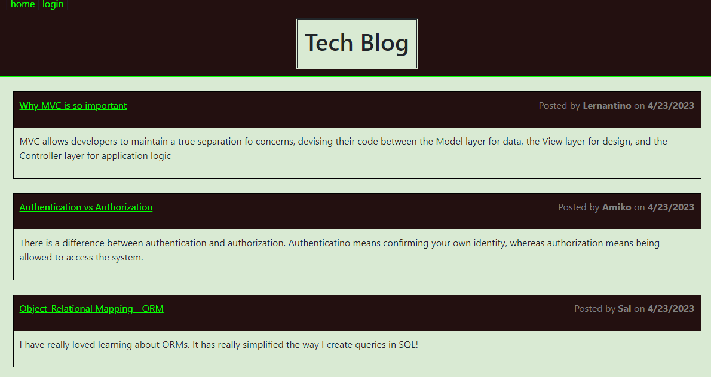
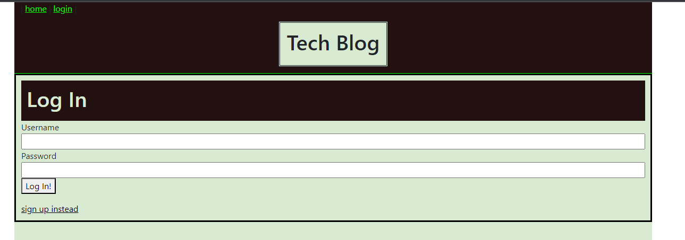
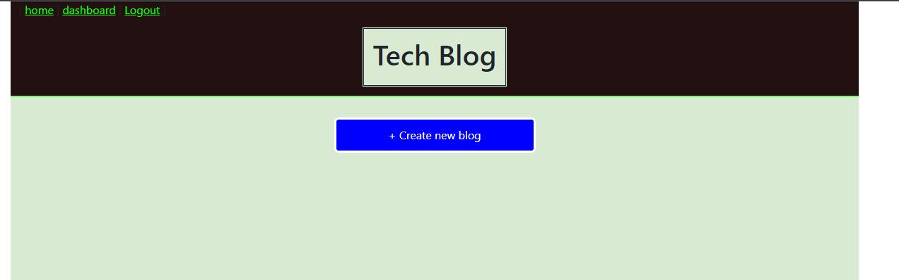
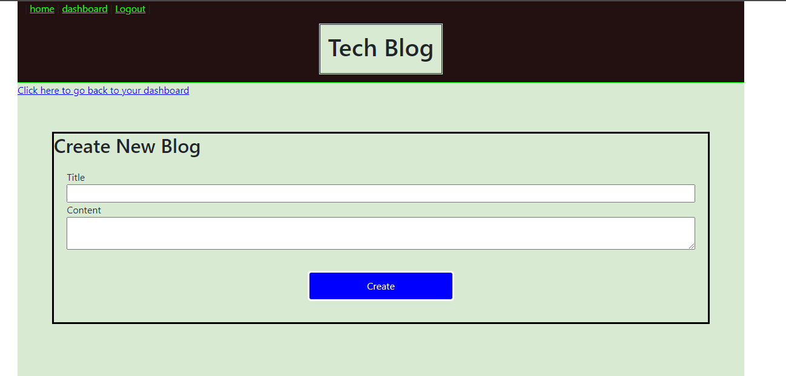

# MVCMVP Module 14 Tech Blog Challenge

## Description

This project is a CMS style blog site that is similar to a Wordpress site. Users can publish blog posts and comment on other developer's posts as well. This app follows the MVC paradigm in its architectural structure, uses Handlebars.js as the templating language, Squelize as the ORM, and the express-session npm package for authentication.

## Table of contents

- [Installation](#installation)
- [Usage](#usage)
- [Contributions](#contributions)
- [Tests](#tests)
- [License](#license)
- [Questions](#questions)

## Installation

This is a fully deployed app on Heroku. No installation required. Simply visit the deployed app at https://vast-cliffs-35981.herokuapp.com/

## Usage

A user will visit this site that the deployed URL. They will be presented with a list of existing blog entries that they can read through. If they want to comment on one, or write an entry of their own they will be requried to sign up. If the user has previously signed up for the site they will be able to log in with their existing username and password.

---

---

## Contributions

There are no official contributors to this project. However, instruction staff from UofM bootcamp course, TA's, tutor sessions, and help from additional students all were required in order to finish this project. Other sources of course included stackoverflow, W3 schools, youtube, and general pouding my head against a brick wall for hours on end.

## Tests

N/A

## License

MIT License

(https://opensource.org/licenses/MIT)

A short and simple permissive license with conditions only requiring preservation of copyright and license notices. Licensed works, modifications, and larger works may be distributed under different terms and without source code.

## Questions

If you have questions on this project you can find me on Github at https://github.com/JonahKane
or please feel free to email me at JonahTKane@gmail.com
